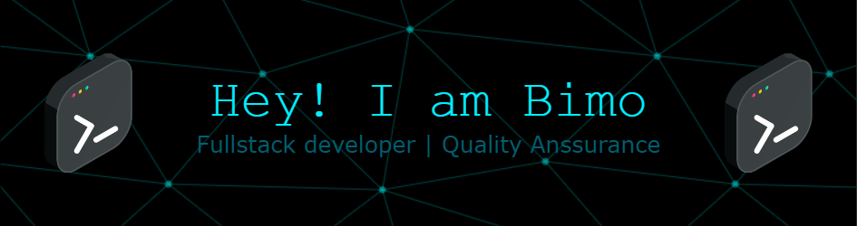

# 👋 Hello World! I'm Alexander Arya

---

---

## 👨‍💻 About Me

- 🔭 Currently working in the **Retail Industry**
- 🌱 Exploring the [**Laravel**](https://laravel.com/) framework & [**Google Cloud Platform**](https://www.googleadservices.com/pagead/aclk?sa=L&ai=DChsSEwi3o6b9gOWOAxVYqmYCHZZUOMUYACICCAEQABoCc20&co=1&ase=2&gclid=Cj0KCQjwhafEBhCcARIsAEGZEKK41s7R3Q6JOZ-5uR4Gi77PnHCr2b67A-VCVlgz7oNTrMsqVF3UT8YaAmeQEALw_wcB&ohost=www.google.com&cid=CAESV-D2f9DX1HFP8gBoOLT0nwIm8k1yG3jRwmd34cKzz1toM0AQtgI1OVk7kggNT8Qsp2Rv5uqtOjGBoR8V4BQDv9MSdH6EcVQWKduytmh8KWrmrRoPhmmMig&category=acrcp_v1_45&sig=AOD64_1qg4vNGYlmDmXaifUCcvZvcBTfjg&q&nis=4&adurl&ved=2ahUKEwjsuKH9gOWOAxUvxzgGHawuL20Q0Qx6BAgJEAE)
- 🎓 Graduated in **Information Technology**
- 💬 Ask me about **Laravel**, **Flask**, **PostgreSQL**, **MongoDB**, or **API Architecture**, **Oracle**
- 🧠 Passionate about **Web Development** and **Software Architecture**

---

## 🚀 Tech Stack

### 🛠️ Backend Development

- **PHP (Laravel)** – Building RESTful APIs and scalable backend systems
- **Python (Flask)** – Lightweight APIs and microservice architecture
- **JavaScript (Node.js - basic)** – Scripting and asynchronous tasks

### 🎨 Frontend Development

- **HTML5**, **CSS3**, **JavaScript**, **JQuery**
- **Bootstrap** – Responsive UI design
- **Tailwand CSS**

### 🗄️ Databases

- **MySQL** – Relational data modeling
- **PostgreSQL** – Advanced queries and performance optimization
- **MongoDB** – Schema-less data & NoSQL integration

### 🧰 Tools & DevOps

- **Git & GitHub** – Version control and collaboration
- **Postman** – API testing & debugging
- **Docker (basic)** – Containerization for development environment

---

---

## 📫 Get in Touch

- 📧 Email: [bimowibowo4846@gmail.com](mailto:bimowibowo4846@gmail.com)
- 💼 LinkedIn: [linkedin.com/in/andreanvinibimo](https://www.linkedin.com/in/andreanvinibimo/)
- 📷 Instagram: [instagram.com/vinibimo](https://www.instagram.com/vinibimo/)

---

## ⚡ Fun Fact

> I enjoy building fun & useful side projects 🚀

---

## 🧠 Skills & Technologies

### Languages & Frameworks

### Databases

### Databases

---

## 📊 GitHub Stats

  
   
  
   
  

---

## 🏆 GitHub Trophies

---

###

###
